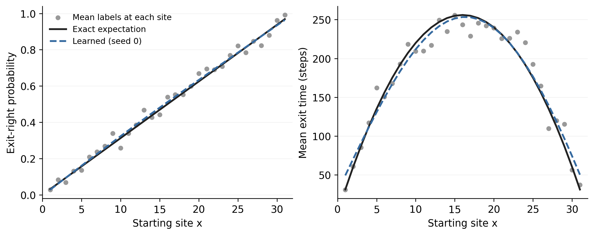

# Learning without Convergence

Reproducible companion experiments for Vignesh Gopakumar's blog post
**Learning without Convergence: Learning deterministic expectations from deliberately noisy Monte Carlo estimates**.

[Website repository](https://github.com/gitvicky/website) ·
[PTNO paper](https://arxiv.org/abs/2609.40090)

The accompanying post is maintained in the website checkout at `Blog/learning_from_convergence.qmd`.

The examples generalize the noisy-supervision argument in PTNO. They do not reproduce its particle-transport benchmarks.

## Reproduce

Use Python 3.11 or 3.12. No GPU, dataset downloads, or training service is required.

```bash
git clone https://github.com/gitvicky/learning-from-convergence.git
cd learning-from-convergence
python3 -m venv .venv
source .venv/bin/activate
python -m pip install -r requirements.txt
python experiments.py
python random_walk.py
python build_interactive.py
python verify.py
```

The reference run used Python 3.12.7, NumPy 1.26.4, PyTorch 2.5.1, and Matplotlib 3.10.8.
The Gaussian experiments took about 13 seconds and the random-walk experiment about 9 seconds
on the development machine, excluding import/font-cache time.
Fixed seeds and deterministic CPU operations make repeat runs reproducible within that environment;
floating-point results may differ across platforms or dependency versions.

## Gaussian expectations and simulation allocation

For `X | a ~ Normal(a, 1)`, the exact expectation is `F(a) = a² + 1`.
The label at a configuration is the mean of `N` simulated values of `X²`.
Configurations are drawn uniformly from `[-3, 3]`.

1. **Learning through noise.** Figure 1 shows every training label for `M=4096, N=1`
   and the network trained with seed 0. It receives no exact targets during training.
2. **Fixed simulation budget.** Figure 2 compares `(M,N)=(4096,1),(512,8),(64,64)`,
   with `K=1`. Each fit uses exactly `M*N=4096` normal draws.
   All eight seeds (0–7) are shown; diamonds mark their means.


Every fit uses the same `1 → 32 → 32 → 1` tanh MLP, a linear final layer,
full-batch Adam with learning rate `0.01`, and 800 updates. Input division by 3
and target division by 10 are fixed linear scalings, not data-derived or nonlinear transforms.
No architecture comparison, hyperparameter sweep, early stopping, or exact-label selection is used.
The test MSE is the average squared error on a fixed 1,001-point grid in `[-3,3]`.
The exact expectation is used only for evaluation and visualization.

Across allocations, each seed shares model initialization, the configuration RNG seed,
and a stream of 4,096 Gaussian noise draws. The configurations are nested prefixes,
and the noise draws are regrouped as `M × N`. Within each fit all draws are independent.
This coupling makes allocations partially paired without pretending that their training datasets are identical.
All allocations use equal optimizer update counts; they do **not** use equal training wall time.
The budget measures simulation generation, not training cost, diagnostics, or repeated reuse of stored labels.

| M | N | Test MSE, mean ± sample SD (8 seeds) |
|---:|---:|---:|
| 4096 | 1 | 0.0607 ± 0.0856 |
| 512 | 8 | 0.0922 ± 0.1182 |
| 64 | 64 | 0.0414 ± 0.0282 |

These runs show that one-sample labels can learn an accurate map. They do not show that
`N=1` is optimal. Here the lowest mean error occurs at `(64,64)` and seed distributions overlap.
Do not interpret this small illustrative study as a statistically established ranking.

## Complete random walks: two expectations from one trajectory

A symmetric walk starts at an integer `x` between absorbing boundaries `0` and `L=32`.
Each transition moves left or right with equal probability. Simulate until absorption,
without a time cutoff. One trajectory supplies two unbiased labels: an indicator of
exiting at the right boundary and the exit time in steps. Their exact expectations are
`x/L` and `x*(L-x)`; see [Aldous and Fill, §5.1](https://www.stat.berkeley.edu/users/aldous/RWG/Book_Ralph/Ch5.S1.html).

`random_walk.py` trains a `1 → 32 → 32 → 2` tanh MLP on 4,096 independent trajectories
per seed. Starting sites are sampled uniformly from the 31 interior sites, so sites
recur. The input is divided by 32; the two output labels are divided by 1 and 1,024.
Training minimizes their mean squared error using full-batch Adam, learning rate
`0.01`, and 800 updates. Exact expectations enter only evaluation and plotting.



Relative L2 errors across all 31 sites, mean ± sample SD over seeds 0–7:

| Quantity | Relative error |
|---|---:|
| Exit-right probability | 1.66% ± 0.45% |
| Mean exit time | 3.87% ± 1.07% |

Seed 0 uses 716,131 transitions; across seeds, transition counts range from 700,141
to 734,694. Equal trajectory counts therefore do not imply equal simulation costs.
This finite configuration space illustrates pooling noisy observations across sites;
the experiment does not establish an efficiency advantage over direct simulation.

### Interactive explorer

Open `results/walk_demo.html` in a browser after running `build_interactive.py`.
It also works when served with `python -m http.server`. No network connection or
Python backend is required to interact with the built page.

Choose a starting site, 1–256 trajectories, either quantity, and a model training seed.
Resample to change the MC draws or animate their addition. The display shows complete
paths, the expectation map, and the running MC estimate compared with the frozen model.
All eight models use the actual exported trained weights, evaluated directly in JavaScript;
`verify.py` checks those weights against the saved PyTorch predictions.

The source files are [`interactive/walk_demo.html`](interactive/walk_demo.html),
[`interactive/walk_demo.css`](interactive/walk_demo.css), and
[`interactive/walk_demo.js`](interactive/walk_demo.js). The browser generates 256 complete
walks with Mulberry32, initially seeded with 17; the count slider selects a prefix.
Changing the starting site regenerates this stream and resampling increments the seed.
The browser draws are separate from training and use a different RNG from Python.
Model weights remain fixed when samples change. Raw model predictions are displayed
without clipping or substituting the exact formulas.

Animation adds complete trajectories in their predetermined order. Its visual timing
does not represent transition costs. A partially animated path is excluded from every
MC mean until it reaches a boundary, avoiding selection based on which paths finish
fastest. Keyboard controls, plot descriptions, reduced-motion behavior, and a static
figure fallback are included.

## Jensen bias without another learned model

At `a=0, N=1`, the estimator is `Z²` with `Z ~ Normal(0,1)`.
The exact values are

```text
log E[Z²] = 0
E[log Z²] = -EulerGamma - log(2) = -1.2703628454614782
Var(log Z²) = π² / 2
```

The exact logarithmic mean follows by differentiating
`E[(Z²)^t] = 2^t Γ(t+1/2)/Γ(1/2)` at `t=0`.
The identity `ψ(1/2) = -EulerGamma - 2 log(2)` is given in
[NIST DLMF §5.4](https://dlmf.nist.gov/5.4#E13).

An independent set of 200,000 draws gives a mean log of `-1.27193`
(standard error `0.00497`) and a log sample mean of `0.00003`.
The code takes the natural logarithm directly; it does not clip or add epsilon.
These diagnostic draws are separate from each model's simulation budget.

## Outputs and checks

`experiments.py` writes SVG and 240-dpi PNG versions of both figures, the 24 individual
fit metrics in `metrics.csv`, the exact and predicted grid values in `predictions.npz`,
a generated Markdown results table, and settings/versions/Jensen diagnostics in `summary.json`.
The committed results are from the documented reference run.
`random_walk.py` also saves all eight fits, transition counts, model weights, and
the seed-0 starting sites and individual trajectory labels. `build_interactive.py`
embeds the model weights in a standalone HTML page and a Quarto include.

`verify.py` checks the budget ledger, recomputes all test errors and seed summaries from
the saved curves, independently checks the Gaussian moments, and compares the numerical
Jensen gap with its exact value. It does not demand a particular allocation ranking.
For the walk example it independently solves the finite-state harmonic and Poisson
equations, checks simulation means against those solutions, recomputes all model errors,
and checks the transition ledger and exported weights.

To copy regenerated figures and the table into a local website checkout:

```bash
python export_site.py /path/to/website
```

This copies the three figures (SVG/PNG), generated table, and interactive include/CSS/JS to
`Blog/assets/learning_from_convergence/`. Article text is maintained in the website repository.

## Statistical scope

Conditionally unbiased targets with finite second moments leave the squared-loss
**population optimum** unchanged. This does not guarantee finite-data recovery,
optimizer convergence, out-of-distribution generalization, or an unbiased learned predictor.
Nonlinear label transforms generally shift the conditional-mean target.
Composing learned primitive expectations avoids that label bias but can amplify approximation error.
For covariance, distinguish unbiased sample covariance from biased nonlinear transformations
such as Cholesky factors; Bessel-corrected variance labels remain valid direct targets.

## References

The full blog bibliography is provided in [`references.bib`](references.bib).
Its core sources are [PTNO](https://arxiv.org/abs/2609.40090),
[Noise2Noise](https://proceedings.mlr.press/v80/lehtinen18a.html),
[stochastic kriging](https://doi.org/10.1287/opre.1090.0754),
[replication versus exploration](https://arxiv.org/abs/1710.03206),
[WoS-NO](https://arxiv.org/abs/2603.01193),
[CTMC moment maps](https://arxiv.org/abs/2606.18409),
[Nonlinear Noise2Noise](https://arxiv.org/abs/2512.24794),
[nested Monte Carlo](https://proceedings.mlr.press/v80/rainforth18a.html),
and [unbiased coupled MCMC](https://arxiv.org/abs/1708.03625).
